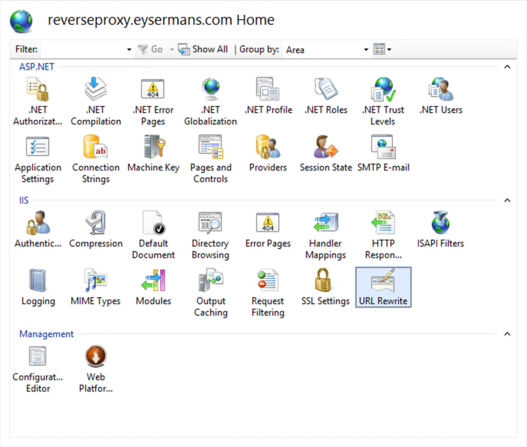
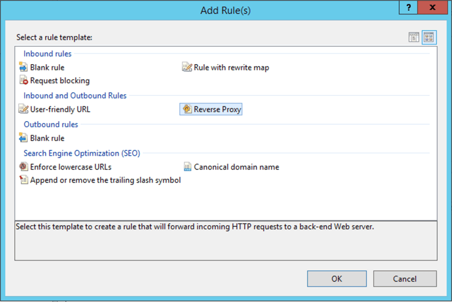
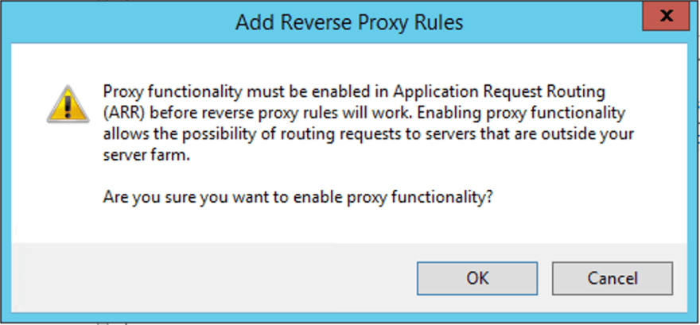

# Deployment to IIS

## Frontend

- we use PM2 https://pm2.keymetrics.io/

### Install dependencies
- install node
- `npm install pm2@latest -g`
- install project dependencies

### Setup Reverse Proxy

To configure IIS as reverse proxy you need to install the [URL Rewrite extension](https://www.iis.net/downloads/microsoft/url-rewrite) and the [Application Request Routing extension](https://www.iis.net/downloads/microsoft/application-request-routing). 

Select the site for which you want to set up the reverse proxy and open the URL Rewrite extension.

Add a new rule and select the Reverse Proxy template. 

Enable proxy functionality when you are prompted for it.

Add the address of your node.js website, don't forget to include the port, to the reverse proxy rules. 

Once the rule has been added, the reverse proxy configuration works.

Run the app once by simple using cmd to run
`npm run start:pm2`

Check it be running 
`pm2 show nextjs` 